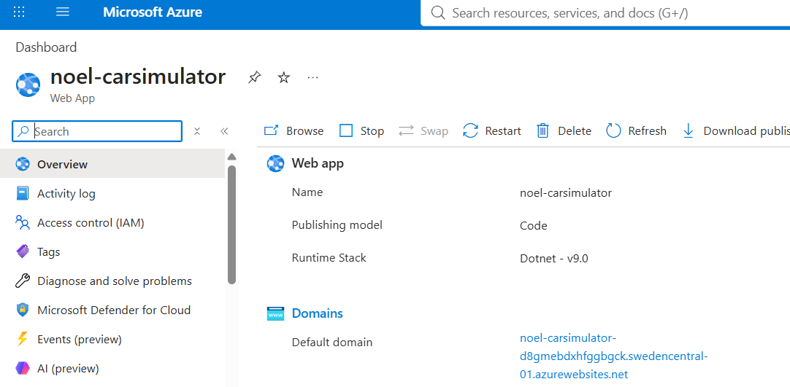
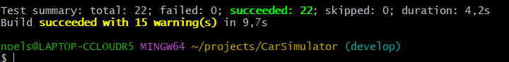
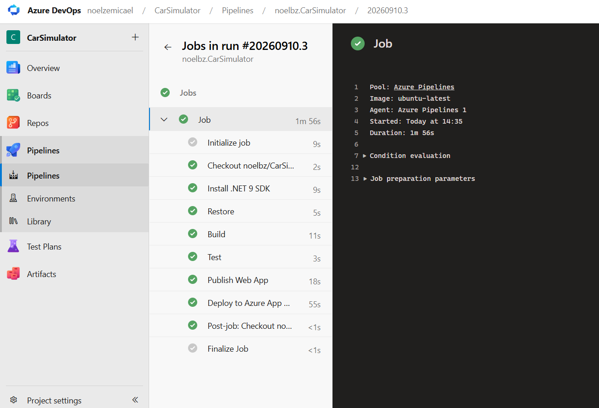
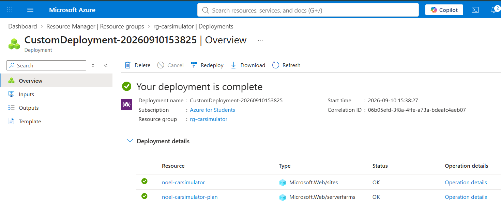
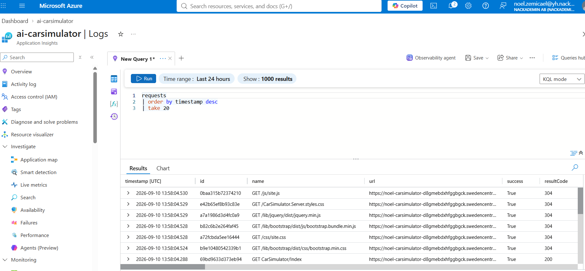
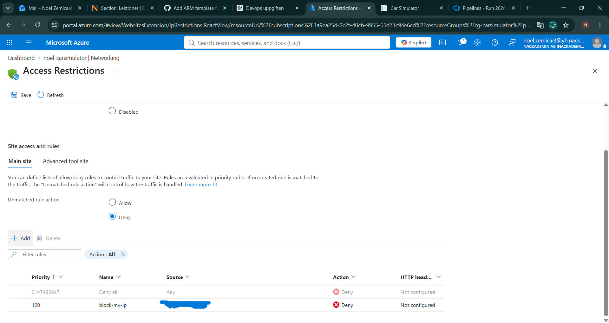
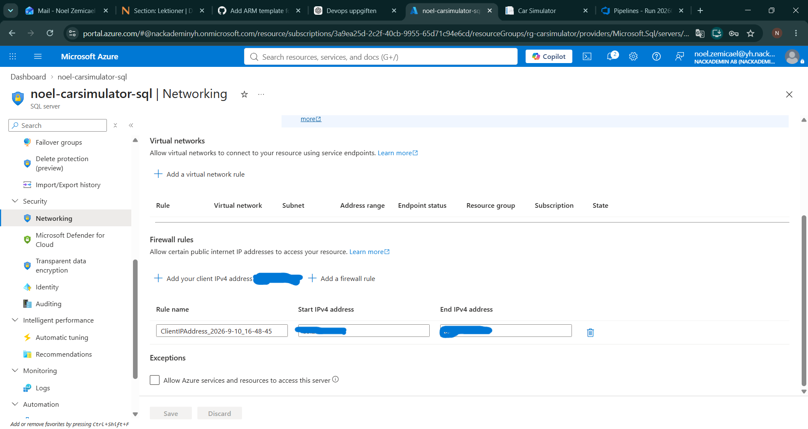

# CarSimulator

Det här projektet är en vidareutveckling av CarSimulator där jag har jobbat med tester, Gitflow, Azure DevOps och Azure.

## Build

För att bygga projektet:

```bash
dotnet restore CarSimulatorApp.sln
dotnet build CarSimulatorApp.sln
```

## Tests

För att köra tester:

```bash
dotnet test CarSimulatorApp.sln
```

Jag har 22 xUnit-tester och alla tester går igenom.

## G1 - Jämföra versioner av kod

Jag har använt Git commits för att kunna se vad som ändrats i koden.

Med en commit diff kan man se vilka rader som lagts till, ändrats eller tagits bort.

**Bevis:**  
[Se commit diff](https://github.com/noelbz/CarSimulator/commit/02e4c2d61b24ebc88c71279a015aa458d6740600)

I denna commit lade jag till tester för bilens funktionalitet för att kunna verifiera att logiken fungerar som den ska.

## G2 - Gitflow

Jag har jobbat med dessa brancher:

- `main`
- `develop`
- `feature/unit-tests`
- `feature/pipeline`
- `feature/arm-template`

Jag har jobbat i feature-brancher och sedan mergat dem till `develop` med Pull Requests.

**Bevis:**

- [Unit tests PR](https://github.com/noelbz/CarSimulator/pull/1)
- [Pipeline PR](https://github.com/noelbz/CarSimulator/pull/2)
- [ARM PR](https://github.com/noelbz/CarSimulator/pull/3)

## G3 - Konfiguration

Det finns olika sätt att ha inställningar i en app.

- `appsettings.json` används för vanliga inställningar.
- Environment variables används för inställningar utanför koden.
- Pipeline variables används av Azure DevOps i pipelinen.
- Lösenord och andra hemligheter ska inte ligga i repositoryt.

## G4 - Azure App Service

Jag har publicerat CarSimulator till Azure App Service.

**App Service:**  
`noel-carsimulator`

**Region:**  
`Sweden Central`

**Publik URL:**  
[Öppna CarSimulator](https://noel-carsimulator-d8gmebdxhfggbgck.swedencentral-01.azurewebsites.net)

**Bevis:**  


## G5 - Unit Tests

Jag har skapat ett testprojekt som heter:

`CarSimulator.Tests`

Jag har 22 tester som bland annat testar:

- vänster
- höger
- framåt
- reverse
- gas
- energy
- statusmeddelanden
- factories
- att gas och energy inte går under 0

Alla tester går igenom.

**Bevis:**  


## G6 - Pipeline

Jag har skapat en Azure DevOps pipeline i:

`azure-pipelines.yml`

Pipelinen kör:

- Restore
- Build
- Test
- Publish
- Deploy

Om build eller tester failar så ska deployment inte fortsätta.

**Pipeline run:**  
[Se lyckad pipeline](https://dev.azure.com/noelzemicael/CarSimulator/_build/results?buildId=3&view=logs&j=12f1170f-54f2-53f3-20dd-22fc7dff55f9)

**Bevis:**  


## G7 - ARM Template

Jag har skapat en ARM Template i:

`infrastructure/azuredeploy.json`

Den används för att skapa eller uppdatera:

- App Service Plan
- Web App

Deploymenten lyckades i Azure.

**Bevis:**  


## G8 - Monitoring och Logging

Jag har aktiverat Application Insights för webbappen.

Jag använde Logs och körde denna query:

```kusto
requests
| order by timestamp desc
| take 20
```

Där kunde jag se requests till webbappen och om de lyckades.

**Bevis:**  


## G9 - IP restriction

Jag skapade en IP-regel på App Service.

Jag satte regeln till:

`Deny`

Jag testade att regeln fungerade och tog sedan bort den igen så att jag inte blockerade mig själv permanent.

**Bevis:**  


## G10 - Azure SQL Firewall

Jag har skapat en Azure SQL Server.

**SQL Server:**  
`noel-carsimulator-sql`

Jag skapade en firewallregel för min publika IP-adress på SQL-servern och verifierade att regeln var sparad och aktiv i Azure.

**Bevis:**  


## Container Deployment

Container deployment betyder att man paketerar appen tillsammans med det den behöver för att kunna köras.

Ett exempel är Docker.

En fördel är att appen kan köras på liknande sätt i olika miljöer.

## Infrastruktursäkerhet

Några viktiga saker för säkerhet är:

- inte lägga lösenord eller tokens i repositoryt
- använda environment variables eller secret variables för hemligheter
- använda IP restrictions för webbappen
- använda firewallregler för SQL-servern
- bara ge användare och tjänster de behörigheter de behöver

## Deployment

Deployment sker automatiskt genom Azure DevOps.

Flödet är:

`Build -> Test -> Publish -> Deploy`

Webbappen deployas till:

`noel-carsimulator`
